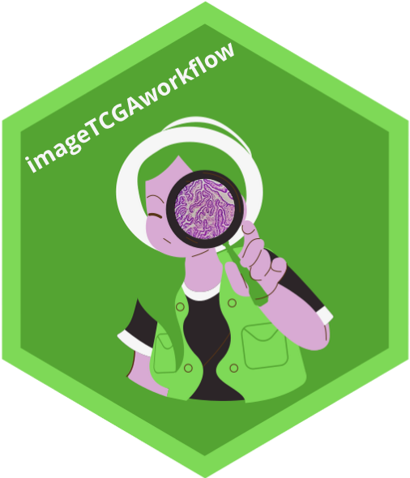
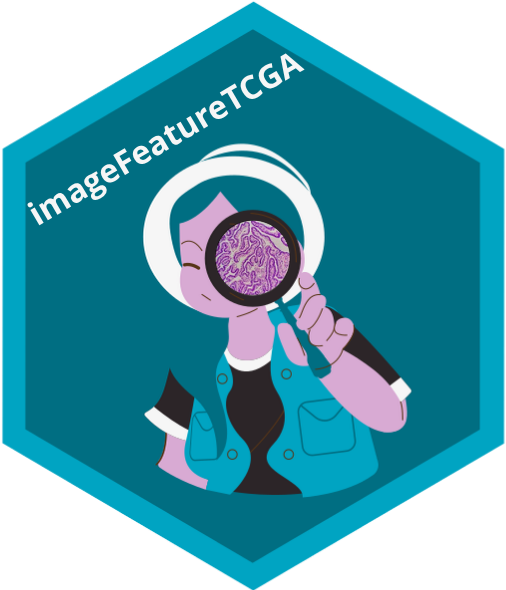
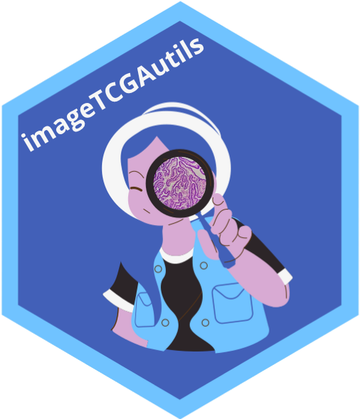

# imageTCGAWorkflow



An end-to-end Bioconductor workflow for histopathology image analysis using TCGA diagnostic whole-slide images.

## Ecosystem packages

<table>
<tr>
<td align="center" width="200">
<a href="https://github.com/billila/imageTCGA">
<br/>
<strong>imageTCGA</strong>
</a><br/>
<em>Shiny app for image discovery</em>
</td>
<td align="center" width="200">
<a href="https://github.com/waldronlab/imageFeatureTCGA">
<br/>
<strong>imageFeatureTCGA</strong>
</a><br/>
<em>Import HoVerNet & GigaPath features</em>
</td>
<td align="center" width="200">
<a href="https://github.com/waldronlab/imageTCGAutils">
<br/>
<strong>imageTCGAutils</strong>
</a><br/>
<em>Spatial statistics & dimensionality reduction</em>
</td>
<td align="center" width="200">
<a href="https://github.com/waldronlab/HistoImagePlot">
<br/>
<strong>HistoImagePlot</strong>
</a><br/>
<em>Histopathology visualization</em>
</td>
</tr>
</table>

## Overview

The TCGA image database contains ~11,765 diagnostic whole-slide images (WSI) from ~9,640 patients. This workflow covers:

1. **Data discovery** — browse and select images with the `imageTCGA` Shiny app
2. **Data access** — download WSIs from GDC using `GenomicDataCommons`
3. **Feature retrieval** — import pre-computed HoVerNet and Prov-GigaPath features via `imageFeatureTCGA`
4. **Spatial analysis** — PCA, Moran's I, LISA with `imageTCGAutils`
5. **Visualization** — overlay cell segmentation on tissue thumbnails with `HistoImagePlot`
6. **Downstream analyses** — multi-omics integration (MOFA+), point pattern analysis, survival


## Installation

```r
if (!requireNamespace("BiocManager", quietly = TRUE))
    install.packages("BiocManager")

BiocManager::install(c(
    "billila/imageTCGA",
    "waldronlab/imageFeatureTCGA",
    "waldronlab/imageTCGAutils",
    "waldronlab/HistoImagePlot"
))
```

## Website

Full workflow documentation: <https://billila.github.io/imageTCGAWorkflow>
